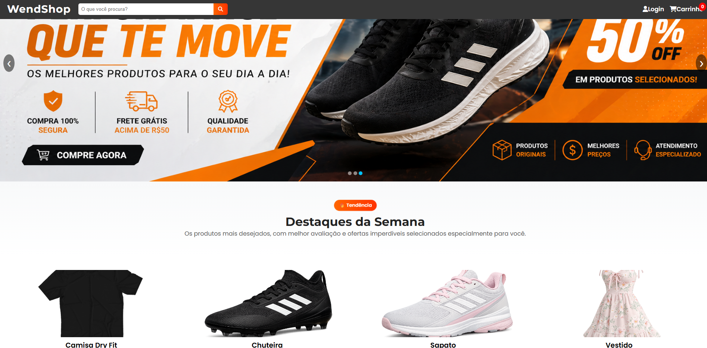

# 🛒 Wendshop-Ecommerce

## 🚀 Projeto online

Landing page de e-commerce moderna e responsiva, focada em performance, usabilidade e experiência do usuário.

---

## 🔥 Demonstração

👉 [Acessar projeto online](https://wendsoncardoso.github.io/Wendshop-Ecommerce/)

---

## 📸 Preview

<p align="center">
  
</p>

---

## 🚀 Tecnologias utilizadas

- HTML5  
- CSS3  
- JavaScript  
- Responsividade (Mobile First)  

---

## 🎯 Funcionalidades

- Carrinho de compras  
- Simulação de checkout  
- Animações modernas  
- Design responsivo  
- Interface estilo e-commerce  

---

## 📂 Estrutura do projeto

```bash
├── index.html
├── carrinho.html
├── css
├── js
├── imagens
```

---

## 📌 Autor

Desenvolvido por **Wendson Cardoso**
